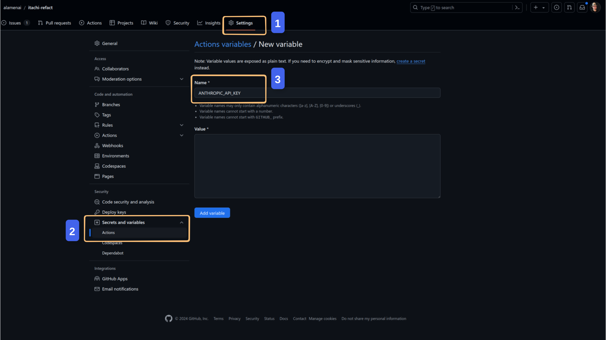

<h1 align="center">Itachi Refact</h1>
<h3 align="center">An intelligent bot powered by Claude-AI, designed to automatically refactor code in pull requests for optimization and best practices before merging, ensuring cleaner, more efficient code integration.</h3>

<h4 align="center"><a href="https://github.com/apps/itachi-refact">Install Itachi Refact Bot</a></h4>

## Configuration

1. Go to the repository where you want to use this bot.

2. Click `Settings`.

3. Click` Actions` under `Secrets and Variables`.

4. Switch to the `Variables` tab and create a new variable, `ANTHROPIC_API_KEY`, with the value of your Anthropic API key.

